# Lyrion Yandex Bridge — интеграция мультирум‑колонок Lyrion Music Server в Умный Дом Яндекс

если неработает пишите novash.ki@gmail.com https://t.me/udylifehack

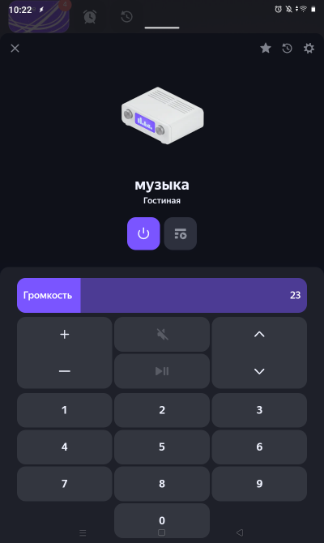

Переработка проекта [squeeze-alice](https://github.com/knovash/squeeze-alice):
клиент работает как **плагин LMS** (автостарт вместе с сервером, автоперезапуск) и ходит в Яндекс
через **облако‑релей по WebSocket** — проброс портов и белый IP не нужны.

- Голосовое управление LMS плеерами через Алису
- Голосовой поиск в Spotify через Алису
- Включение каналов, соответствующих закладкам в Избранном LMS
- Использование LMS плееров в сценариях УДЯ
- Автоматическая синхронизация колонок при включении
- Выключение всех колонок одной кнопкой или одной командой
- Установка громкости при включении с задержкой для ожидания выхода плеера из спящего режима
- Установка громкости при включении колонки в зависимости от времени суток
- Ограничение максимальной громкости от случайного превышения
- Управление с телефона через виджеты Tasker и отображение состояния плееров — **TODO**: серверная часть готова, проект виджетов пока в [squeeze-alice](https://github.com/knovash/squeeze-alice)
- Управление кнопками с пульта
- Поиск в Spotify с голосового пульта (Yandex SST); поиск в Избранном с пульта — **TODO**
- Передача голосовых и звуковых уведомлений на колонки LMS (Yandex TTS)
- Репитер пульта для увеличения расстояния — **TODO**: скрипты пока в [squeeze-alice](https://github.com/knovash/squeeze-alice)


## Голосовое управление устройством УДЯ «музыка»

- **«Алиса, включи музыку»** — Включит воспроизведение ⏯️.  
  Если есть колонка или группа уже играющая, то подключит колонку к играющим.  
  При включении колонки громкость будет установлена в соответствии с временем суток.  
  Если плейлист пустой, то включит Избранное 1.

- **«Алиса, выключи музыку»** — Остановит воспроизведение на колонке в комнате; если колонка была в группе, остальные комнаты продолжат играть.
- **«Алиса, выключи музыку везде»** — Остановит воспроизведение на всех устройствах Музыка; 
- **«Алиса, переключи сюда»**
    - Перенесёт воспроизведение на колонку LMS в этой комнате.
    - Если в телефоне играет **Spotify** перенесет его в колонку LMS.
    - Если надо выключить все другие кроме этой комнаты
- **«Алиса, канал 5»** — Включит из Избранного LMS закладку 5.
- **«Алиса, переключи канал»** — Включит следующую закладку в Избранном LMS.
- **«Алиса, музыку громче/тише»** — Изменит громкость плеера в LMS.
- **«Алиса, музыка громкость 15»** — Установит громкость 15 плеера в LMS.
- **«Алиса, дальше»** — Следующий трек.
- **«Алиса, назад»** — Предыдущий трек.
- **«Алиса, отдельно»** — Заблокирует автосинхронизацию плеера LMS.
- **«Алиса, вместе»** — Отменит блокировку автосинхронизации плеера LMS.
- **«Алиса, повтор»** / **«Алиса, рандом»** — Включит/выключит повтор и случайный порядок.
- **«Алиса, добавь в избранное»** — Добавит текущий трек в избранное LMS.
- **«Алиса, подключи пульт»** — Подключит пульт к колонке LMS в этой комнате.

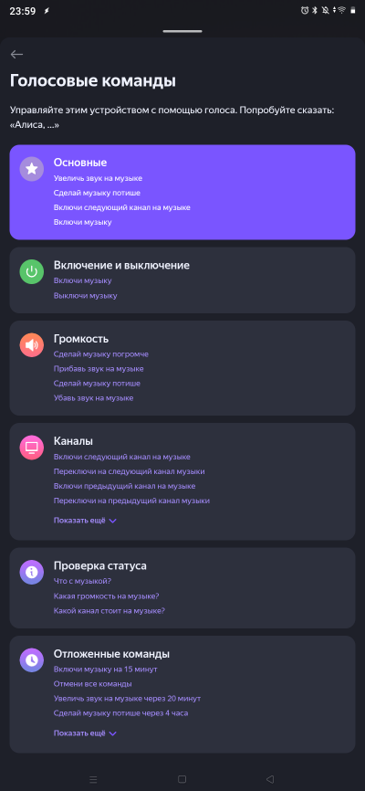

## Управление через голосовой навык Алисы

«раз два» — имя для активации навыка.

- **«Алиса, скажи раз два, включи Kraftwerk»** — Найдёт в **Spotify** исполнителя Kraftwerk.
- **«Алиса, скажи раз два, включи альбом Depeche Mode Violator»** — Найдёт в **Spotify** альбом.
- **«Алиса, скажи раз два, включи трэк Depeche Mode Personal Jesus»** — Найдёт в **Spotify** трек.
- **«Алиса, скажи раз два, включи плейлист …»** — Найдёт в **Spotify** плейлист.
- **«Алиса, скажи раз два, включи избранное джаз»** — **TODO**: поиск закладки Избранного LMS по названию пока не перенесён (плохо работал с транслитерацией).
- **«Алиса, скажи раз два, что играет»** — Алиса ответит название трека и громкость.
- **«Алиса, скажи раз два, какая громкость»** — Алиса ответит текущую громкость и ограничение громкости.

Для настройки:

- **«Алиса, скажи раз два, это комната Гостиная»** — Привяжет колонку Яндекс с Алисой к этой комнате.
- **«Алиса, скажи раз два, выбери колонку homepod»** — Привяжет колонку LMS к этой комнате.
- **«Алиса, скажи раз два, лимит 60»** — Установит ограничение громкости 60 для плеера LMS.

Этот навык пока ещё приватный, но я могу прислать вам ссылку.

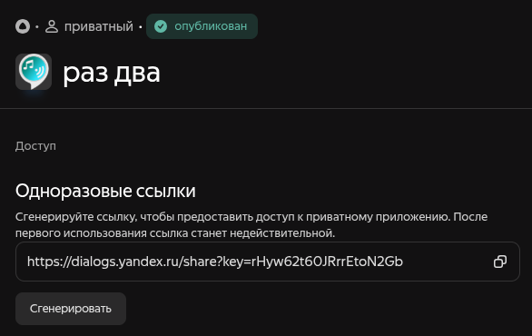

## Управление с телефона виджетами Tasker

### Доступ к управлению всеми плеерами прямо с рабочего стола не заходя в приложение

Серверная часть готова: клиент принимает команды Tasker по `/cmd` (виджеты управления,
состояние всех плееров, плейлист, настройки). **TODO**: сам проект Tasker
(`tasker/squeeze-tasker.prj.xml`, [taskernet: Lyrion Music Server Widgets](https://taskernet.com/?user=AS35m8l41V5ZEnau2L8l%2Feyup%2F3dACIp9knWIQaItDG9k2AY77ZyUTy5Vq2Zvd0TdHMDzA%3D%3D))
пока не перенесён из [squeeze-alice](https://github.com/knovash/squeeze-alice).

- виджеты для всех команд управления
- голосовой поиск в Spotify
    - включи <исполнитель>
    - включи альбом <исполнитель> <альбом>
    - включи трек <исполнитель> <трек>
- виджеты колонок для выбора и отображения сосотояния
- текстовый виджет состояния всех плееров
- текстовый виджет плейлиста
- отправка голосового сообщения на колонку LMS

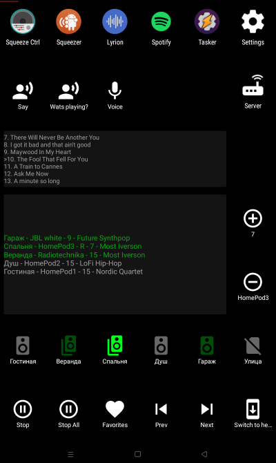
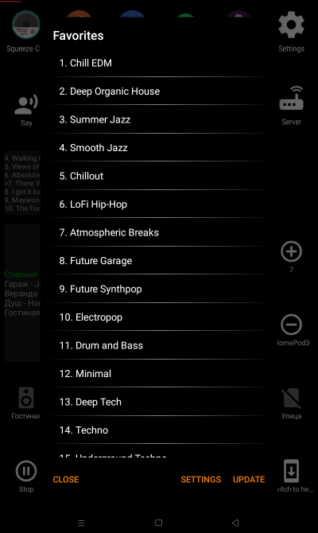
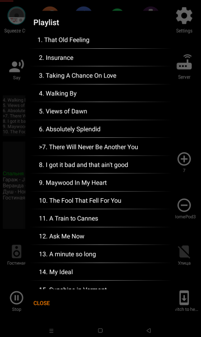

## Управление с голосового пульта

Серверная часть готова (голосовой поиск, кнопки, сигналы, TTS-ответы колонки).
**TODO**: python-скрипты пульта (`btremote.py`, `voice.py`) пока не перенесены —
брать из [squeeze-alice](https://github.com/knovash/squeeze-alice), каталог `squeeze_remote/`.

- Нажать кнопку микрофон 🎤 на пульте.
- После сигнала в колонке LMS произнести в пульт запрос, например «включи Kraftwerk».
    - включи <исполнитель>
    - включи альбом <исполнитель> <альбом>
    - включи трек <исполнитель> <трек>
- Звуковой сигнал после записи голоса.
- Записанный голос распознаётся через Yandex SST.
- По полученному тексту находится исполнитель в Spotify.
- Колонка LMS ответит «Включаю Kraftwerk».
- Включится воспроизведение Kraftwerk на колонке LMS.

### Кнопки для пульта G20pro

- 🎤 — голосовой поиск в Spotify
- 1️⃣ … 9️⃣ — закладки в Избранном LMS
- ➕ — громче
- ➖ — тише
- ⏯️ play/pause — для колонки LMS в этой комнате (остальные продолжат играть)
- ◀️ previous track
- ▶️ next track
- 🔼 previous channel
- 🔽 next channel
- ⏮️ rewind 20s
- ⏭️ forward 20s
- ⏹ stop all — выключить все LMS‑колонки в доме
- **Del** — «что играет» (колонка LMS ответит название и громкость)
- 🏠 «переключи сюда» — музыка переключится на эту колонку, другие выключатся
- **Pg+** — переключить пульт на следующую колонку LMS

переключи сюда, также переключает на колонку из Spotify с телефона если сейчас играет.


Настраиваются кнопки в файле `config.conf` (пример для play/pause):

```json
{"code": 164, "description": "KEY_PLAYPAUSE", "command": "/cmd?player=btremote&action=play_pause"}
```

## Удлиннитель bt пульта
Если использовать пульт в комнате далеко от сервера с LMS можно использовать orangePiZero как репитер для пульта, установив на него
`squeeze_remote/btremote.py`
`squeeze_remote/voice.py`

**TODO**: скрипты репитера пока не перенесены — брать из [squeeze-alice](https://github.com/knovash/squeeze-alice).

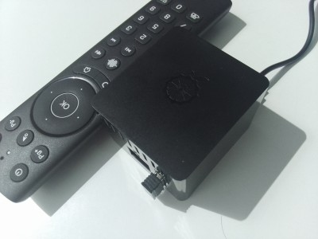


## Управление с пульта телевизора
Проект Tasker (`tasker/squeeze-tasker.prj.xml`) устанавливается на android tv или tv box,
для назначения действий на кнопки можно использовать tvQuickActions.  
**TODO**: конфигурация пока не перенесена — брать из [squeeze-alice](https://github.com/knovash/squeeze-alice).
Тут уже смотря какой пульт и сколько на нем бесполезных кнопок, например так:
- mute - play/pause
- mute (doble) - stop all
- mute (long) - Избранное LMS
- menu (long) - виртуальный dpad tvquickactions для громкости и переключения треков

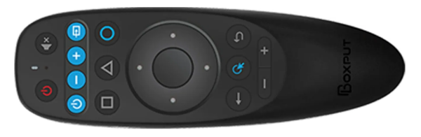
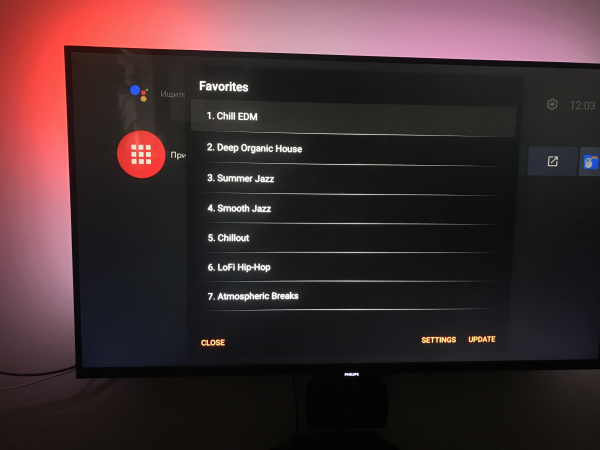
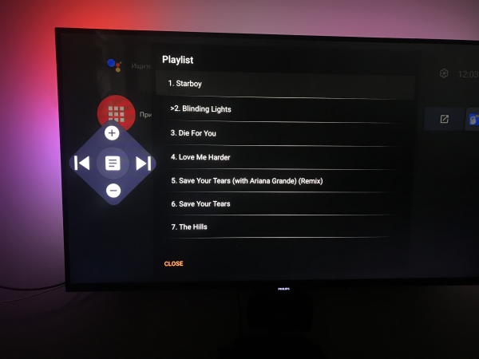


---


### 🖥️ Веб‑интерфейс

Доступен по адресу `http://<ip-lms>:8888`

- Авторизация в Яндексе и Spotify.
- Настройка плееров:
  - Привязка к комнате УДЯ
  - ожидание пробуждения плеера
  - ограничение громкости
  - пресеты громкости по времени

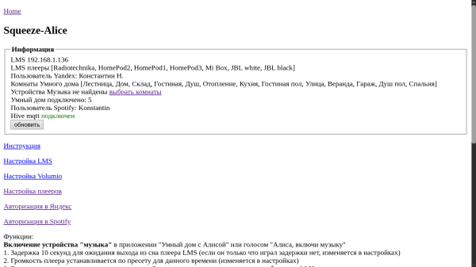

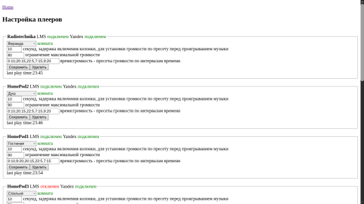

---
## ⚙️ Установка и настройка

### Установка плагином LMS (рекомендуется)

1. LMS → Настройки → Плагины → внизу «Дополнительные репозитории» → добавить:
   `https://raw.githubusercontent.com/knovash/lyrion-yandex-bridge/main/repo.xml`
2. Перезапустить LMS и включить плагин **Lyrion Yandex Bridge** в списке сторонних плагинов.
3. Требуется Java 11+ на хосте LMS (например, `sudo apt install openjdk-17-jre-headless`) —
   плагин сам найдёт java (путь из настроек → PATH → `/usr/lib/jvm/*/bin/java`).
4. Клиент запустится автоматически, его веб‑интерфейс: `http://<ip-lms>:8888/`
   (управление клиентом: Настройки → Плагины → Lyrion Yandex Bridge: статус, Restart,
   порт, доступ из сети, путь к java).

### Вручную из zip (Debian/Ubuntu, LMS из пакета lyrionmusicserver)

```bash
sudo unzip -o target/lyrion-yandex-bridge-<версия>-lms-plugin.zip -d /usr/share/squeezeboxserver/Plugins/
sudo chown -R squeezeboxserver:nogroup /usr/share/squeezeboxserver/Plugins/LyrionYandexBridge
sudo systemctl restart lyrionmusicserver
```
Для LMS в Docker / других платформ — распакуйте zip в каталог плагинов вашего дистрибутива
(НЕ в cache/InstalledPlugins) и перезапустите LMS. Подробности: [lms-plugin/README.md](lms-plugin/README.md).

### Первичная настройка

После установки веб‑интерфейс клиента будет доступен по адресу http://<ip-lms>:8888/

1. Если сервис успешно обнаружил LMS то будет список плееров из LMS
2. Авторизуйтесь в Яндекс для соединения с акаунтом умного дома
3. Если авторизация успешна то будет список комнат из УДЯ
4. Перейдите в настройку плееров и выберете соответствующие комнаты
5. В приложении Яндекс «Умный дом» 
 - Добавить > Устройство умного дома
 - Найти производителя Lyrion Music Server
 - Нажать "Привязать к Яндексу"
 - Нажать "Обновить список устройств"
 - Нажать "Ура, теперь всё готово!"

Этого достаточно для управления плеерами LMS через УДЯ.
1. Сервис запущен, найдены плееры в LMS

   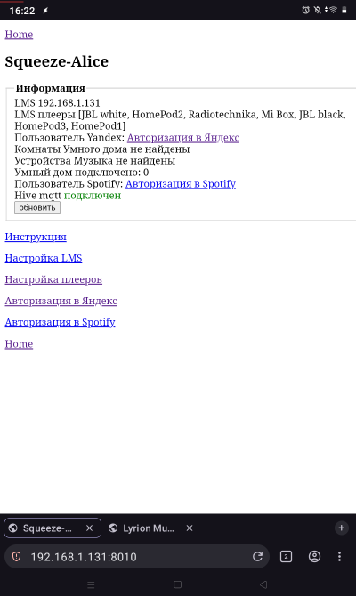

2. Авторизация в Яндекс

   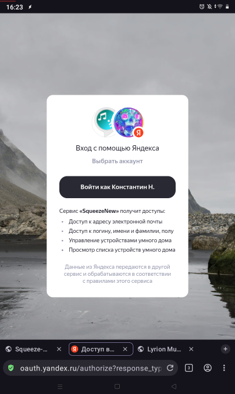

3. После авторизации получены комнаты из УДЯ

   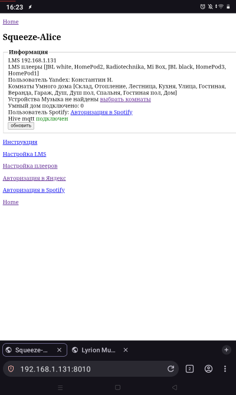

4. Плееры, комнаты не выбраны

   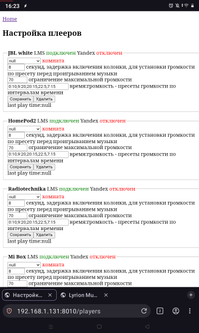

5. Плееры, комнаты выбраны

   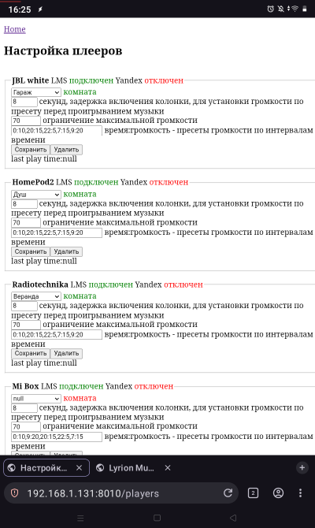

6. УДЯ добавить устройство

   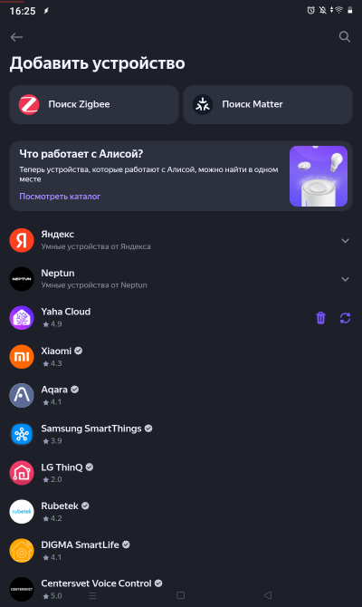

7. Найти Lyrion Music Server

   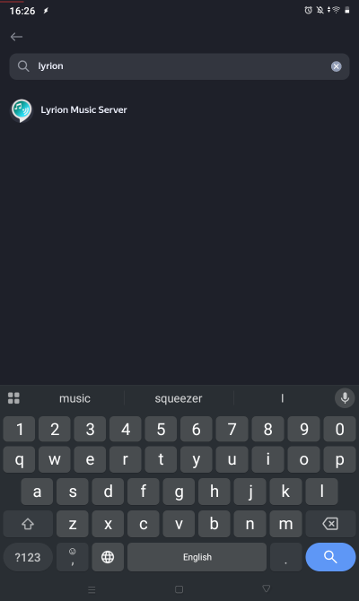

8. Привязать к Яндексу

   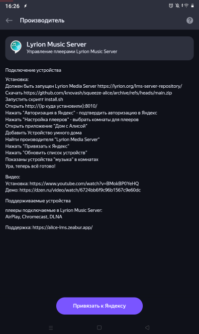

9. Вход в Яндекс

    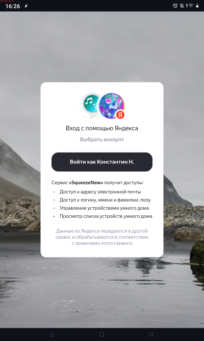

10. Подтверждение доступа

    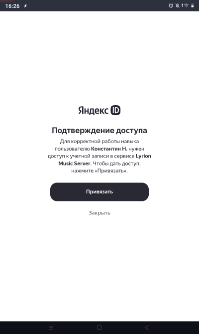

11. Устройства успешно добавлены!

    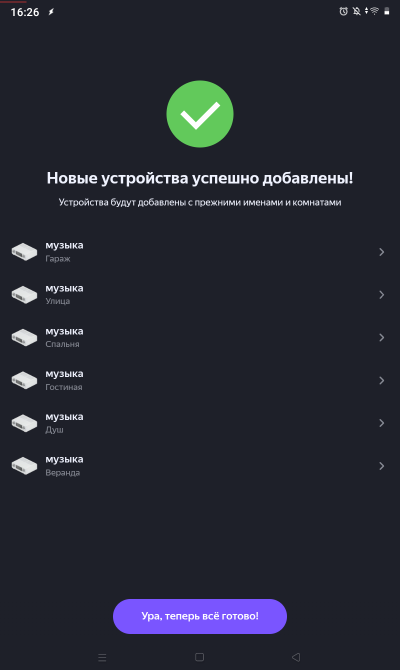

12. Новые устройства в доме

    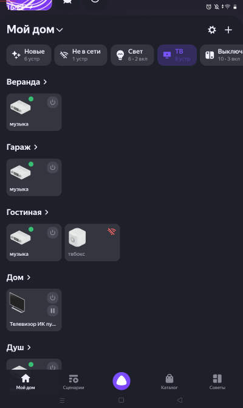

---

Ещё можно добавить:  
- Установить tasker/squeeze-tasker.prj.xml для виджетов управления и отображения плееров — **TODO** (взять из [squeeze-alice](https://github.com/knovash/squeeze-alice))
- Голосовой навык Раз Два для голосового поиска и дополнительных команд
- Авторизоваться в Spotify для поиска
- Установить squeeze_remote/btremote.py для управления пультом — **TODO** (взять из [squeeze-alice](https://github.com/knovash/squeeze-alice))
- Установить squeeze_remote/voice.py для голосового поиска с пульта — **TODO** (взять из [squeeze-alice](https://github.com/knovash/squeeze-alice))

Баги есть, но я над этим иногда работаю...

TODO:
- Алиса включи наушники, подключать bt наушники к LMS
- голосовой поиск в избранном сейчас только на русском, плохо работает с транскрипцией в англиский («включи избранное джаз»)
- управление громкостью уведомлений, сейчас через ffmpeg, сделать изменение громкости в LMS или в tts (усиление выше 3 искажает)
- убрать логин в Spotify API для поиска, использовать внутренний поиск LMS (неполучилось)
- перенести из squeeze-alice: проект Tasker (виджеты), скрипты пульта squeeze_remote/ (btremote.py, voice.py, репитер orangePiZero), конфиг ТВ-пульта (tvQuickActions)
- настройки вкл/выкл голосовых уведомлений — уже реализовано (страница «Настройки голоса»)
- голосовые уведомления через колонку в LMS — уже реализовано (Yandex TTS)
- голосовое сообщение на колонку с телефона не из дома — работает через облако (без MQTT, он больше не используется)

## Сборка и состав репозитория (для разработки)

```
mvn package
# → target/lyrion-yandex-bridge-<версия>.jar (fat-jar)
# → target/lyrion-yandex-bridge-<версия>-lms-plugin.zip (плагин)
```

- `src/main/java/knovash/saclient/` — java‑клиент: провайдер УДЯ, LMS‑клиент, навык «Раз Два»,
  Spotify, голос/TTS, облачный транспорт, веб‑настройки
- `lms-plugin/` — perl‑плагин LMS: запуск клиента, автоперезапуск, страница настроек
- `repo.xml` — дескриптор plugin‑репозитория для LMS (в корне, пушится как есть)
- `img/` — скриншоты
- `cline_docs/` + `.clinerules` — Memory Bank: контекст проекта для ИИ‑агента (Cline),
  читается при старте сессии и обновляется после работы

Выпуск новой версии — чек‑лист в [lms-plugin/README.md](lms-plugin/README.md).

## Зачем я это делал?
- Чтобы не объяснять никому дома как включить музыку на колонки из Lyrion или Spotify и прочего. Просто нажми кнопку на пульте или скажи алисе включи музыку, избранное, альбом...
- Чтобы не объяснять как управлять синхронизацией колонок, просто включи музыку, выключи музыку, переключи сюда.
- Когда вы перед телевизором, не нужно искать телефон или думать про голосовые команды. Достаточно нажать кнопку на том же пульте ТВ чтоб выключить музыку в комнате или во всем доме.
- Просто включить телефон или планшет и сразу увидеть состояние всех плееров не заходя ни в какие приложения, выполнять с экрана действия с колонками в пару кликов.
- Пульт с реальными кнопками — самый интуитивный интерфейс. На него не нужно смотреть, и кнопки запоминаются на уровне мышечной памяти, это как кнопки в автомобиле, быстро и понятно. Управлять музыкой, не отвлекаясь на экраны, — только пульт и колонки.
- Каждая фича просто становилась необходимой мне в какойто момент и я ее добавлял.
- Почему LMS, а не мультирум на Яндекс Станциях? Нет ограничений. В LMS можно подключить любые колонки и множество источников музыки.


